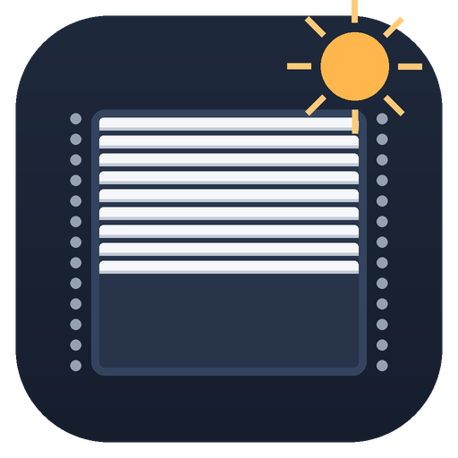

<p align="center">
  
</p>

# Chained Blinds Controller

[](https://github.com/snapicek/home-assistant-blinds/actions/workflows/validate.yml)
[](https://github.com/snapicek/home-assistant-blinds/releases)
[](LICENSE)
[](https://hacs.xyz)

A Home Assistant custom integration for **chain-driven motorized blinds** where both 0 % and 100 % are fully dark and the position of maximum light differs per physical cover and must be calibrated individually.

The integration automatically moves your covers through four semantic states based on a lux sensor and configurable thresholds — all tunable live from the dashboard without restarting Home Assistant.

---

## Features

- **Four semantic states** — `open`, `medium`, `shade`, `closed` — mapped to per-cover calibrated raw positions.
- **Automatic lux-based control** — moves covers darker as light increases, lighter when light drops, using separate thresholds for each direction (hysteresis).
- **Dwell lock** — prevents rapid down→up→down cycling that can damage chain-drive mechanisms.
- **Night window** — configurable time range during which the integration holds the blind closed regardless of lux.
- **Manual override** — dedicated switch holds the current position for a configurable number of minutes, then auto-clears; no external `timer` helper needed.
- **Optional gradual ramping** — when enabled, blinds move toward the target in configurable step sizes at configurable intervals.
- **Fully UI-configured** — Config Flow setup, all thresholds and calibration values adjustable via dashboard entities (no YAML editing).
- **Two-cover rooms** — left and right covers move together with a 1 s stagger so they don't strain the same circuit simultaneously.

---

## Requirements

| Requirement | Notes |
|---|---|
| Home Assistant | ≥ 2026.5 |
| A lux sensor entity | e.g. `sensor.living_room_illuminance` |
| One or two `cover` entities | Chain-driven roller blind(s) |

---

## Installation

### Via HACS (recommended)

1. Open HACS in Home Assistant.
2. Go to **Integrations** → click the three-dot menu → **Custom repositories**.
3. Paste `https://github.com/snapicek/home-assistant-blinds` and set category to **Integration**, then click **Add**.
4. Search for **Chained Blinds Controller** and click **Download**.
5. Restart Home Assistant.

### Manual

1. Download or clone this repository.
2. Copy the `custom_components/chained_blinds/` folder into your Home Assistant config directory:
   ```
   <config>/custom_components/chained_blinds/
   ```
3. Restart Home Assistant.

---

## Configuration

1. Go to **Settings → Devices & Services → Add Integration**.
2. Search for **Chained Blinds Controller** and select it.
3. Fill in the config form:
    - **Room name** — used as the prefix for all created entities.
    - **Left cover** *(required)* — a `cover` entity.
    - **Right cover** *(optional)* — second `cover` entity; moves 1 s after the left one.
    - **Lux sensor** — a `sensor` entity reporting illuminance in lux.
4. Click **Submit**. A new device appears under **Devices & Services**.

You can change any of these settings at any time via the integration's **Configure** button.

### Calibration

Each semantic state maps to a raw cover position (0–100 %). After setup, open the room's device page and adjust the `number` entities:

| Entity | What to set |
|---|---|
| `number.<room>_left_open_pos` | Raw % giving maximum light for the left cover |
| `number.<room>_left_medium_pos` | Partial-shade position |
| `number.<room>_left_shade_pos` | Sun-blocking position |
| `number.<room>_right_*_pos` | Same for the right cover |

All changes take effect on the next evaluation cycle — no restart or reload needed.

### Device entities

Action entities are intended for daily control and should stay visible on the
main device view.

| Entity | Purpose |
|---|---|
| `switch.<room>_enabled` | Turn automatic blind control on or off |
| `switch.<room>_override` | Temporarily pause automation while keeping the current blind position |
| `select.<room>_state` | Manually move blinds to `open`, `medium`, `shade`, or `closed` |
| `time.<room>_open_time` | Set the daily morning time when daytime behavior may resume |

Settings entities are maintenance/configuration controls and are best kept in
the device Settings section.

| Entity | Purpose |
|---|---|
| `number.<room>_lux_medium` | Brightness level that starts moving toward medium shade |
| `number.<room>_lux_medium_reopen` | Lower brightness needed before moving back toward medium |
| `number.<room>_lux_high` | Brightness level that starts moving toward full shade |
| `number.<room>_lux_high_reopen` | Lower brightness needed before moving back from full shade |
| `number.<room>_dwell_minutes` | Minimum delay before another darkening move |
| `number.<room>_reopen_dwell_minutes` | Minimum delay before another opening move |
| `number.<room>_override_duration_minutes` | How long pause automation stays active before auto-clear |
| `number.<room>_ramp_step_percent` | Position delta used for each gradual movement step |
| `number.<room>_ramp_interval_minutes` | Minimum minutes between gradual movement steps |
| `number.<room>_sunrise_offset_minutes` | Shift computed sunrise earlier/later |
| `number.<room>_sunset_offset_minutes` | Shift computed sunset earlier/later |
| `number.<room>_summer_lux_factor` | Seasonal multiplier for summer brightness response |
| `number.<room>_winter_lux_factor` | Seasonal multiplier for winter brightness response |
| `number.<room>_<left/right>_<state>_pos` | Per-cover calibration percentage for each semantic state |
| `switch.<room>_ramp_enabled` | Enable step-by-step gradual motion instead of direct jumps |
| `switch.<room>_seasonal_split` | Enable separate summer/winter sensitivity multipliers |
| `switch.<room>_sunrise_open` | Use sunrise (plus offset) as morning opening boundary |

Number entities display as whole numbers to reduce visual noise (for example
`12000 lx` instead of `12000.0 lx`).

---

## How it works

<details>
<summary>Show details</summary>

Covers are moved only via `cover.set_cover_position` with an explicit calibrated percentage — never `open_cover`/`close_cover`. This guarantees physical accuracy regardless of the cover's internal state tracking.

The resolver evaluates the following priority order on every 5-minute poll **and** whenever the lux sensor changes:

1. **Night window** — if the current time is inside the configured night range, target state is `closed`.
2. **Lux thresholds** — compares the smoothed lux value against `lux_close` (to darken) and `lux_reopen` (to lighten).
3. **Dwell lock** — a lightening move is only issued if at least `dwell_minutes` have elapsed since the last move.
4. **Manual override** — if `switch.<room>_override` is on, no automatic moves are issued until it turns off.

| State | Rank | Description |
|---|---|---|
| `open` | 0 | Maximum light (~75 %, calibrated per cover) |
| `medium` | 1 | Partially closed |
| `shade` | 2 | Sun-blocking position |
| `closed` | 3 | Fully dark, 0 % |

Darkening (rank ↑) is immediate. Lightening (rank ↓) requires crossing the `lux_reopen` threshold **and** waiting out the dwell period.

</details>

---

## Development

```bash
pip install pytest pytest-asyncio homeassistant
pytest
```

The test suite in `tests/` uses lightweight hand-rolled fakes (`tests/fakes.py`) rather than the full `pytest-homeassistant-custom-component` harness. The resolver unit tests serve as the executable specification for the decision logic.

CI runs HACS validation and hassfest on every push — see `.github/workflows/validate.yml`.

---

## Contributing

Pull requests and issues are welcome. Please open an issue first for larger changes.

[Open an issue](https://github.com/snapicek/home-assistant-blinds/issues)

---

## License

[MIT](LICENSE) © 2026 Snapicek
